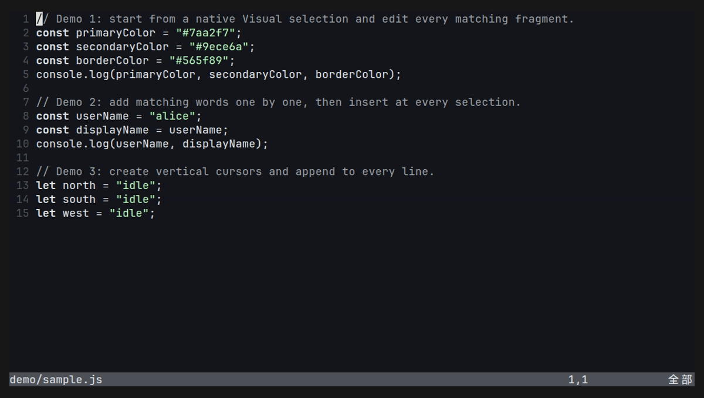

# visual-multi.nvim

<p align="center">
  <strong>English</strong> · <a href="./README.zh-CN.md">简体中文</a>
</p>

A small, native Lua multi-cursor plugin for **Neovim 0.12+**.

> [!IMPORTANT]
> This project evolved from the original
> [`mg979/vim-visual-multi`](https://github.com/mg979/vim-visual-multi)
> repository. The current Lua rewrite was implemented entirely by AI under user
> direction. It targets current Neovim only and does not preserve Vim or legacy
> `vim-visual-multi` compatibility.

The implementation uses Extmarks and granular buffer update events.

## Motivation

1. **Keep only the core workflow.** Remove legacy compatibility layers and
   advanced features that are not essential to selecting, navigating, and
   editing with multiple cursors.
2. **Improve performance substantially.** Use native Lua, Extmarks, batched
   selection creation, binary-search cursor lookup, and serialized Insert
   updates without per-keystroke full redraws.

### Approximate performance comparison

The following is a single headless run on the same machine with Neovim 0.12.4.
Each line contained one `foo`, and the benchmark selected every occurrence.
The numbers are indicative rather than a rigorous cross-machine benchmark.

| Matches | Original repository | Lua rewrite | Approx. speedup |
| ---: | ---: | ---: | ---: |
| 200 | 62.1 ms | 8.3 ms | 7.5× |
| 500 | 111.5 ms | 16.4 ms | 6.8× |
| 1,000 | 166.4 ms | 30.4 ms | 5.5× |
| 2,000 | 357.3 ms | 55.8 ms | 6.4× |
| 10,000 | 1,669.4 ms | 246.7 ms | 6.8× |

Large synchronized Insert sessions also avoid full highlight reconstruction on
every keypress and process rapid input through a serialized event queue.

## Demo



The demo covers four workflows:

1. Select `Color` with native characterwise Visual mode, press `<C-d>` to select
   every occurrence, and append `Token` synchronously.
2. Press `<C-n>` repeatedly to add `userName` occurrences, then insert `active_`
   at every selection.
3. Add vertical cursors with `<C-Down>` and append to three adjacent lines.
4. Press `v` repeatedly to expand from characters to words, quotes, and enclosing
   calls, then replace every selected call synchronously.

Re-record it after installing [VHS](https://github.com/charmbracelet/vhs), `ttyd`,
and `ffmpeg`:

```sh
./demo/record-demo.sh
```

## Features

- Normal, Insert, and Extend modes with synchronized multi-cursor editing.
- Create selections from the current word, native Visual text, vertical positions,
  or all literal occurrences.
- Synchronized movement, insert, yank, delete, change, paste, undo, `D`, `o`, and `O`.
- Semantic region expansion and one-level shrink with session-local `v` / `V`.
- Fast Lua and Extmark core with batched selection creation and queued Insert updates.
- Compact statusline that follows the region under the real cursor.
- UTF-8-aware, buffer-local sessions with configurable mappings and highlights.

## Installation

With `lazy.nvim`:

```lua
{
  "yaocccc/visual-multi.nvim",
  opts = {},
}
```

The plugin also loads with its defaults when `setup()` is not called explicitly.

## Default mappings

### Start a session

| Mapping | Action |
| --- | --- |
| `<C-n>` | Select word / next occurrence |
| `<C-d>` | Select all occurrences |
| Native Visual + `<C-n>` | Use the selection and add the next occurrence |
| Native Visual + `<C-d>` | Use the selection and select all occurrences |
| `<C-Left>` / `<C-Right>` | Start or extend a selection |
| `<C-Up>` / `<C-Down>` | Add cursor above / below |
| `<C-x>` | Add cursor at current position |
| `<C-w>` | Add the word at current position |

### During a session

| Mapping | Action |
| --- | --- |
| `n` / `N` | Next / previous occurrence |
| `q` | Remove the region under the real cursor |
| `]` / `[` | Focus next / previous region |
| `v` / `V` | Enter or expand Extend selection / shrink one level |
| `h j k l w b e 0 ^ $` | Move cursors or extend selections |
| `i a I A` | Enter synchronized Insert mode |
| `<C-v>` | Paste at every cursor in Insert mode |
| `o` / `O` | Open a new line below / above every cursor and enter Insert mode |
| `D` | Delete from every cursor to the end of its line and enter Insert mode |
| `c d x y p u` | Edit all regions |
| `<Esc>` | Restore the original Normal cursor positions, or end the session from Normal |

Native Visual initialization currently accepts single-line characterwise
selections. `<C-Left>` and `<C-Right>` remain available for plugin-managed
selection expansion. In a session, repeated `v` expands from character to word,
quotes/brackets, and the whole line; `V` restores the previous level. The `h`,
`l`, `w`, `b`, and `e` motions stay within each
cursor's current line; `gg` and `G` are not overridden during a session.

## Configuration

```lua
require("visual-multi").setup({
  wrap = true,
  case_sensitive = true,
  mappings = {
    find_next = "<C-n>",
    select_all = "<C-d>",
    select_left = "<C-Left>",
    select_right = "<C-Right>",
    add_cursor_up = "<C-Up>",
    add_cursor_down = "<C-Down>",
    add_cursor = "<C-x>",
    add_cursor_word = "<C-w>",
    skip_region = false,
    remove_region = "q",
    insert_paste = "<C-v>",
    undo = "u",
    redo = "<C-r>",
  },
})
```

### Highlights

The built-in palette is used when `highlights` is omitted. Every role accepts
either an existing highlight group name or a color table; table-based settings
are reapplied after `ColorScheme`:

```lua
highlights = {
  cursor = "MyCursorGroup",
  cursor_active = { bg = "#dfdf87", fg = "#4e4e4e", bold = true },
  insert = { bg = "#4c4e50" },
  insert_active = { bg = "#4c4e50" },
  selection = { bg = "#005faf" },
  selection_active = { bg = "#87afff", fg = "#4e4e4e" },
}
```

### Statusline

The default statusline is a compact flat bar: its background ends with its
content instead of filling the row, and it has no font-specific glyph dependency.
To override it, pass a formatter:

```lua
statusline = function(info)
  return ("%%#MyVisualMultiBar# %s %d/%d %%*")
    :format(info.mode, info.current, info.total)
end
```

Set a mapping to `false` to disable it. Set `statusline = false` to disable the
statusline replacement. The formatter receives `mode`, `current`, `total`,
`pattern`, and current selection `text` fields.

## Commands

- `:VisualMultiNext`
- `:VisualMultiAll`
- `:VisualMultiAdd`
- `:VisualMultiClear`
- `:VisualMultiInfo`

## License

MIT
